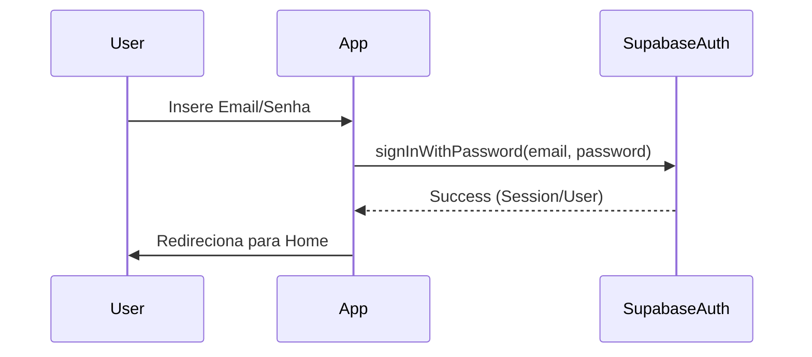

# Especificação Técnica: Implementação de Autenticação Supabase

## 1. Contratos de Interface (Types)

```dart
abstract class IAuthRepository {
  Future<User?> signInWithEmail(String email, String password);
  Future<void> signOut();
  Stream<AuthState> get authStateChanges;
  User? get currentUser;
}
```

## 2. Diagramas de Fluxo (Mermaid)



## 3. Regras de Negócio e Casos de Borda
- **Sessão Expirada**: Se a sessão expirar durante o uso, o Riverpod `authProvider` deve emitir um estado não-autenticado, forçando o redirecionamento para Login via `AppRouter`.
- **Email não verificado**: Impedir acesso caso a configuração do Supabase exija verificação de email.
- **RLS**: Todas as tabelas (`despesas`, `cartao`) devem ter políticas RLS vinculadas ao `auth.uid()`.

## 4. Testes BDD (Behavior Driven Development)
- **Cenário**: Login com credenciais válidas.
- **Dado** que o mock do Supabase retorna um `AuthResponse` de sucesso.
- **Quando** `authRepository.signInWithEmail` é chamado.
- **Então** o estado do `authProvider` deve ser `AsyncData(user)`.
