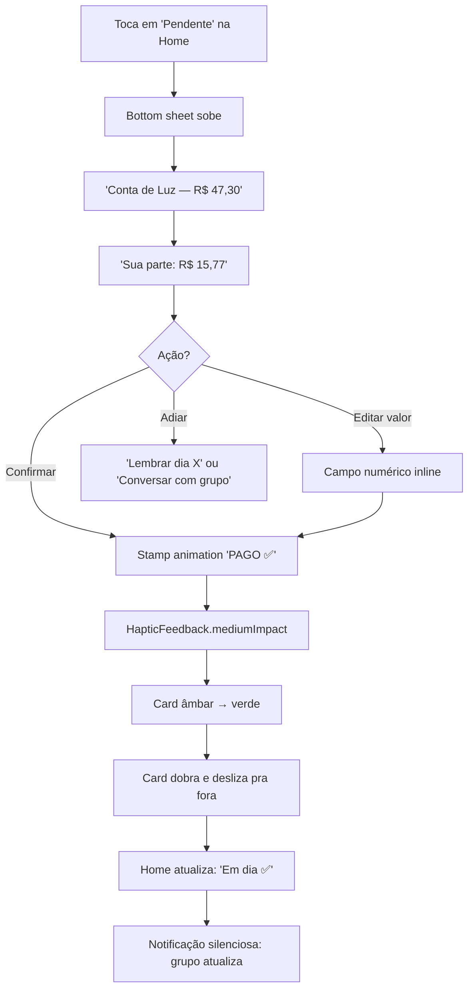
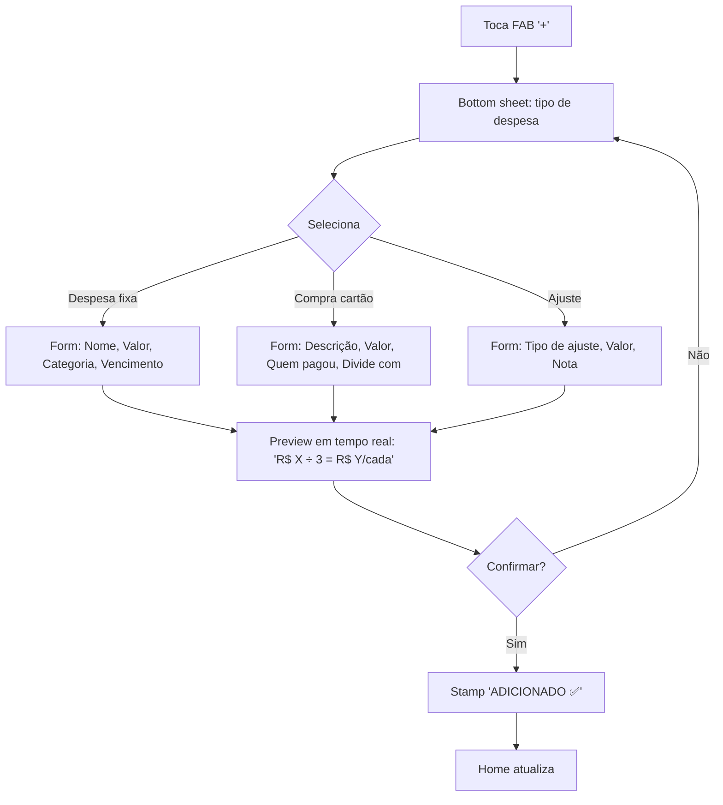
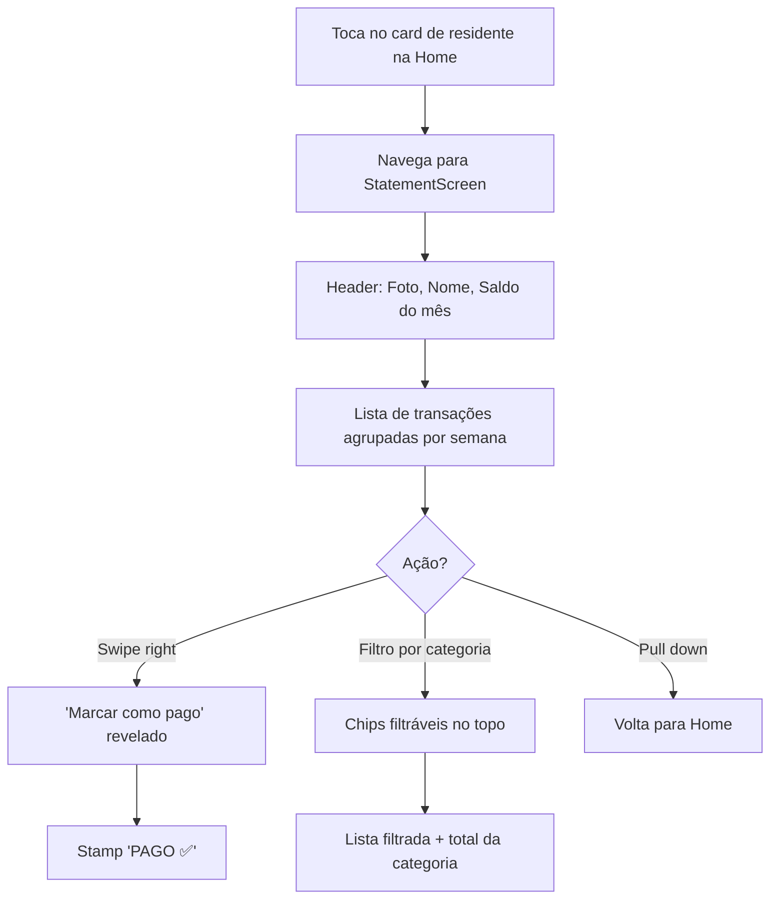
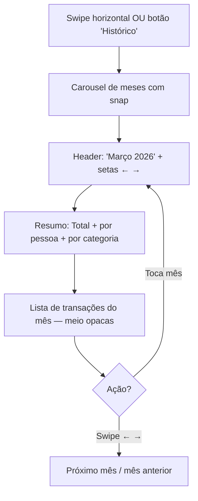

# UX Design Specification financorp

**Author:** Luan
**Date:** 2026-04-12

---

<!-- UX design content will be appended sequentially through collaborative workflow steps -->

## Executive Summary

### Project Vision

**DIVI** é um app de gestão financeira transparente para casas compartilhadas. Ele elimina o atrito social que surge quando moradores dividem contas -- ninguém quer ser o chato que fica cobrando. O app responde em 2 segundos: "Quem deve quanto e quem já pagou?"

Despesas fixas são divididas igualmente entre 3 residentes. Compras de cartão são atribuídas a quem as fez. O app tracking quem pagou e quem deve, oferecendo visibilidade financeira completa por pessoa e para a casa.

### Target Users

**3 residentes específicos de uma casa compartilhada no Brasil:**

- **Luan** (azul, `#3b82f6`)
- **Luciana** (rosa, `#ec4899`)
- **Giovanna** (roxo, `#8b5cf6`)

Usuários brasileiros, falando português, com moeda BRL. App rodando como web deploy (Vercel) e potencialmente mobile Flutter.

**Perfil:** Pessoas que compartilham despesas domésticas, precisam de transparência financeira, e querem evitar conflitos de cobrança manual.

### Key Design Challenges

1. **Informação crítica enterrada:** O dado mais importante (saldo por pessoa e status de pagamento) está atrás de scroll e cards densos, não é a primeira coisa que o usuário vê.

2. **Funcionalidades fantasmas:** Aba Cartão existe mas não está conectada na navegação principal. Tabs (Resumo, Despesas, Cartao) foram projetadas mas não integradas.

3. **Input frictionless:** Modal de adicionar despesas/compras é genérico e burocrático. Usuários registram despesas _depois_ que acontecem -- fricção alta causa procrastinação e app desatualizado.

4. **Sem fluxo explícito de "quitei":** A ação mais importante do app -- marcar como pago -- não tem um fluxo claro com feedback visual. É o momento que reduz tensão social.

5. **Provider monolítico como risco de UX:** `diviEngineProvider` é single source of truth -- se falha, a UX inteira desmorona simultaneamente.

6. **Residentes hardcoded:** Impede escalabilidade do produto e cria dívida técnica que limita melhorias futuras de UX.

### Design Opportunities

1. **"Quem deve quanto" em 2 segundos:** Redesenhar a home para que o status financeiro de cada pessoa seja imediatamente visível, sem interação.

2. **Fluxo de pagamento com impacto visual:** Criar um momento satisfatório de "quitou" -- feedback visual claro, animação, sensação de dever cumprido.

3. **Input rápido para compras pós-evento:** Formulário otimizado para registrar despesas lembradas (valores aproximados, datas passadas, categorias rápidas).

4. **Arquitetura de informação conectada:** Integrar as 3 tabs existentes (Resumo, Despesas, Cartao) na navegação principal, tornando funcionalidades descobríveis.

5. **Notificações e lembretes mensais:** "Sua parte é R$X, pagou?" -- reduzir dependência de memória do usuário.

6. **Estética skeuomórfica consistente:** Aproveitar a metáfora de recibos/papel para criar uma experiência coesa e encantadora em todos os fluxos.

## Core User Experience

### Defining Experience

**Core Experience:** Abrir o DIVI e em 2-3 segundos saber exatamente "estou em dia?" — sem calcular de cabeça, sem navegar, sem perguntar no WhatsApp.

O problema real não é contabilidade — é **ansiedade social**. O momento "aha" é quando o usuário abre o app e respira aliviado (ou não), sem precisar interagir com nada.

DIVI não é um registro de dívidas (como Splitwise). É **cobrança automática + paz mental**. Enquanto Splitwise abre em "adicionar despesa", DIVI abre em "estou em dia?". São perguntas diferentes para produtos diferentes.

### Platform Strategy

**Mobile-first** (iOS + Android via Flutter), web como acesso secundário (landing page com demo, não produto funcional).

**Plataforma Priorities:**

- Push notifications via FCM + Supabase Edge Functions para lembretes de pagamento
- Câmera nativa para registro rápido de recibos (futuro OCR)
- Offline reading via cache local (`isar` ou `shared_preferences`) — mostra último status em 0.5s, atualiza em background
- Token persistente para evitar auth em cada cold start
- Cold start budget: 2-3s | Warm start: 0.5s

### Effortless Interactions

- **Status em 2-3 segundos:** Dashboard com cache-first, skeleton loading, dados cached visíveis imediatamente
- **"1 Toque = Progresso":** Cada toque leva o usuário mais perto do resultado, sem telas desnecessárias no meio
- **Adicionar despesa em < 15 segundos:** Foto do comprovante → categorização automática → confirmação
- **Marcar pagamento com 1 toque:** Ação mais importante do app, feedback visual imediato
- **Estado compartilhado, não feed social:** "Luz paga ✅" é status, não post. Transparência sem ruído.

### Critical Success Moments

1. **Primeiro acesso → "aha, agora eu sei":** Usuário abre, entende a situação em 3 segundos, sem perguntas
2. **Registrar pagamento → "quitei, alívio":** Momento satisfatório com feedback visual claro e sem ambiguidade
3. **Fim do mês → "tá tudo certo, sem surpresas":** Resumo mensal que confirma que nada ficou pra trás
4. **Momento de dúvida → "prova em 2 toques":** Se alguém questiona "eu paguei isso?", o app mostra evidência instantaneamente

### Experience Principles

1. **Clareza > Estética:** Informação visível antes de decoração. Hierarquia tipográfica clara, skeumorfismo nos detalhes periféricos.
2. **1 Toque = Progresso (e 2 toques = prova):** Cada interação avança o usuário. Se precisa provar, está a 2 toques.
3. **Semáforo emocional: informar sem julgar:** Verde = tranquilidade, amarelo = quase lá, vermelho = atenção. Cada cor informa sem culpar.
4. **Contexto Real:** Câmera, offline, push, e o mundo lá fora — não só a tela.
5. **Transparência sem atrito social:** Informar sem acusar, provar sem questionar. Resolver divisões sem criar conflitos.
6. **Recibo é evidência, não enfeite:** A estética skeuomórfica serve à confiança. Pré-renderizada para performance.
7. **Assimetria de envolvimento:** Serve tanto o "administrador" quanto o residente casual que só quer ver "está tudo bem".

## Desired Emotional Response

### Primary Emotional Goals

**Emoção Primária: ALÍVIO** — A ausência de um peso. O usuário abre o DIVI, vê "em dia", e solta o ar que nem sabia que estava prendendo. O ombro relaxa. Não é orgulho, não é controle — é paz.

**Emoção Secundária: COMPETÊNCIA SILENCIOSA** — Quando registra um pagamento, a satisfação quieta de "tirei da minha cabeça". Não é gamificação com confete — é o barulho satisfatório de uma gaveta fechando no lugar certo.

**Emoção de Retenção: PAZ DE QUE NADA ESCAPOU** — Abrir o app e ter certeza de que ninguém está devendo sem eu saber. Vigilância passiva. O app trabalha enquanto você não pensa nisso.

**Personalidade do DIVI:** O amigo calmo. A pessoa no grupo que nunca entra em pânico. Que quando alguém pergunta "e aí, quem pagou a água?" responde tranquilo "já tá tudo certo aqui". Não julga, não cobra — **informa**.

### Emotional Journey Mapping

| Jornada                        | Emoção Alvo           | Sensação                                                             |
| ------------------------------ | --------------------- | -------------------------------------------------------------------- |
| **Primeiro acesso**            | Revelação             | "Nossa, eu não sabia que era isso" — clareza desembaraçando confusão |
| **Ver "em dia"**               | Alívio                | Ombro relaxa, peso saindo do peito                                   |
| **Registrar pagamento**        | Satisfação quieta     | "Tirei da minha cabeça" — competência silenciosa                     |
| **Ver que deve**               | Clareza neutra        | "Preciso cuidar disso" — informação sem culpa                        |
| **Ver que outros pagaram**     | Reconhecimento        | "Vai entrar grana" — justiça sendo feita                             |
| **Ver que outros NÃO pagaram** | Informação contextual | "Falta 1 de 3" — espelhado, não comparativo                          |
| **Fim do mês**                 | Confirmação           | "Tá tudo certo, sem surpresas" — tranquilidade                       |

### Micro-Emotions

**Confiança > Confusão:** Cada número é rastreável, cada cálculo é transparente. Se o app erra uma vez, perdeu credibilidade para sempre.

**Clareza > Surpresa:** Nunca um susto. Transparência calma, sempre. O usuário nunca abre o app e toma uma notícia inesperada.

**Pertencimento > Exclusão:** "2 de 3 em dia ✅" inclui. "Maria pagou, João pagou, você não" exclui e gera vergonha.

**Próximo passo claro > Impotência:** Toda tela de débito precisa mostrar COMO resolver. Ver que deve sem saber o que fazer gera frustração, não ação.

### Design Implications

**Se queremos ALÍVIO:**

- Dashboard em 2-3 segundos com status visual imediato (verde/amarelo/vermelho)
- Zero loading spinners — usar cache-first, skeleton loading suave
- Transição orgânica (papel desenrolando) ao invés de spinner de espera

**Se queremos CLAREZA SEM CULPA:**

- Linguagem de "painel de status", nunca de "cobrança ativa"
- ❌ "Você deve R$45" → ✅ "Sua parte: R$45 (aguardando)"
- ❌ "Atrasado" → ✅ "Pendente"
- ❌ "Vencido" → ✅ "Venceu dia X"

**Se queremos PAZ DE QUE NADA ESCAPOU:**

- Estado compartilhado visível: "2 de 3 em dia" — espelhado, não comparativo
- Não esconder pendências, mas não apontar dedo
- A pessoa pendente **sabe** que é ela. Não precisa escrever o nome em vermelho

**Se queremos COMPETÊNCIA SILENCIOSA:**

- Feedback de pagamento: animação sutil, sem confete
- Som/haptic de "click" satisfatório — gaveta fechando no lugar
- Texto: "Quitado ✅" ou "Registrado" — afirmação curta, não celebração

### Emoções para EVITAR a Qualquer Custo

| Emoção           | Como Aparece                                    | Por Que Mata                              |
| ---------------- | ----------------------------------------------- | ----------------------------------------- |
| **Vergonha**     | Notificação "você deve R$XX", vermelho gritante | A pessoa fecha e não volta                |
| **Surpresa**     | Número inesperado sem contexto                  | Ansiedade retomada, desconfiança          |
| **Impotência**   | Ver dívida sem poder resolver na hora           | Gera frustração, não ação                 |
| **Desconfiança** | Número que não bate com o que a pessoa acha     | Se erra uma vez, perdeu credibilidade     |
| **Confusão**     | Muitas categorias, muitos detalhes              | "Isso é mais complicado que fazer no Zap" |
| **Competição**   | Ranking de quem paga mais, quem deve menos      | Transforma cooperação em veneno           |

### Emotional Design Principles

1. **Paz > Cobrança:** Toda decisão de UX passa por: "isso dá paz ou cobra?" Se cobra, corta. Se dá paz, mantém.
2. **Status > Culpa:** Informar é neutro. Cobrança é pessoal. O app informa, nunca cobra.
3. **Espelhado > Comparativo:** "2 de 3 em dia" inclui. "Você é o único pendente" exclui e gera vergonha.
4. **Calma > Urgência:** O DIVI não grita. Ele sussurra. O tom é de extrato bancário, não de boleto vencido.
5. **Competência Silenciosa > Celebração Exagerada:** Pagar conta não é festa. É dever cumprido. O feedback é sutil, satisfeito, discreto.
6. **Revelação > Input:** Dar valor antes de pedir input. Primeiro win é "entendi a situação que era confusa", não "cadastrei minha despesa".

## UX Pattern Analysis & Inspiration

### Inspiring Products Analysis

**Splitwise — O Padrão Ouro de Divisão, o Antagonista Emocional**
Resolve a matemática de divisão elegantemente. O algoritmo de simplificação de dívidas (A→B→C simplifica para A→C) é genial. Mas falha emocionalmente: abre em "Adicionar despesa" (reativo), vermelho grita culpa, notificações parecem intimação, histórico é planilha glorificada.

**Lição para DIVI:** Copiar a velocidade de input (3 toques) e a simplificação de dívidas. Rejeitar o tom de cobrança e o vermelho de culpa.

**Nubank — A Maestria da Calma Digital**
Saldo em fonte grande, centralizado. Sem gráficos desnecessários. UX writing coloquial: "Você gastou R$X com alimentação". O roxo é identidade, não alarme. Loading state é dança de marca, não spinner genérico.

**Lição para DIVI:** Hierarquia visual — grande o que importa, sutil o detalhe. Tom coloquial e humano. Uma cor dominante que acalma.

**WhatsApp — Onde o Dinheiro Realmente Acontece**
Ticks azuis = confirmação sem pressão. Bolinha verde no ícone = "tem coisa nova, vem ver quando der". Swipe pra responder = natural. Mas: "digitando..." gera ansiedade, bolinha vermelha é viciante e stressante.

**Lição para DIVI:** Sistema de confirmação visual sutil. Bolinha de notificação em verde/azul suave, nunca vermelho. Usar WhatsApp como canal de resumo, não como fonte de verdade.

**Duolingo — O Vício do Bem**
Streak (fogo 🔥) = loss aversion. Som de acerto = dopamina pura. Progress bar enchendo = sensação de avanço. Mas: notificações passivo-agressivas geram culpa — inaceitável para dinheiro.

**Lição para DIVI:** Feedback sensorial de "feito". Barra de progresso do mês. Streak como celebração ("5 dias em dia!"), não cobrança ("não perca seu streak!").

**Apple Reminders / Google Tasks — O Prazer do Check**
Checkmark animado = dopamina. Lista que diminui = "menos pra preocupar". Sweep completed = limpa a tela, foco no que importa.

**Lição para DIVI:** Animação de checkmark satisfatória. Estética de carimbo "PAGO" — tátil, definitivo. Lista que encolhe: quando 4 de 5 contas estão pagas, mostrar só a pendente.

### Transferable UX Patterns

| Padrão                     | Fonte                | Como DIVI Aplica                                                |
| -------------------------- | -------------------- | --------------------------------------------------------------- |
| **Status binário em 2s**   | Nubank + Splitwise   | Tela abre → "Em dia ✓" ou "Atenção: 2 pendentes" — sem tabelas  |
| **Check satisfatório**     | Reminders + Duolingo | Carimbo animado ao marcar pago, som sutil de papel              |
| **Confirmação sem culpa**  | WhatsApp (ticks)     | "João marcou o aluguel" — informação, não cobrança              |
| **Progresso visual**       | Duolingo + Reminders | Barra do mês enchendo, lista encolhendo                         |
| **Tom de amigo**           | Nubank               | UX writing coloquial: "Tudo certo por aqui"                     |
| **Resumo no canal certo**  | WhatsApp             | Enviar resumo semanal no WhatsApp do grupo — espelho, não fonte |
| **3 toques pra adicionar** | Splitwise            | Despesa rápida: valor → categoria → confirmar                   |
| **Sweep completed**        | Reminders            | Contas pagas saem da visão imediata, ficam em "arquivadas"      |

### Anti-Patterns to Avoid

| Anti-Pattern                  | Fonte                     | Por Que Evitar                                                 |
| ----------------------------- | ------------------------- | -------------------------------------------------------------- |
| **Vermelho = culpa**          | Splitwise                 | Gera vergonha, usuário fecha e não volta                       |
| **Notificação de cobrança**   | Splitwise                 | "Fulano te deve R$X" = atrito social direto                    |
| **Planilha disfarçada**       | Splitwise                 | Se a tela principal parece Excel, falhamos                     |
| **Gamificação de culpa**      | Duolingo (quando exagera) | "Você decepcionou a coruja" aplicado a boletos = desastroso    |
| **Presença julgadora**        | WhatsApp ("digitando...") | "Fulano está online e me ignorando sobre dinheiro" = ansiedade |
| **Bolinha vermelha no ícone** | WhatsApp                  | Viciante e stressante. DIVI usa verde/azul suave               |
| **Registro sem propósito**    | Tricount                  | App que só registra morre quando não tem lembrete              |
| **Comunicação bancária fria** | Bancos tradicionais       | "Débito vencido REF: ENERGIA" = desumano                       |

### Design Inspiration Strategy

**O que ADOPTAR (copiar diretamente):**

- Status binário em 2 segundos (Nubank) — grande o que importa, sutil o detalhe
- Checkmark animado satisfatório (Reminders) — dopamina de "feito"
- Confirmação visual tipo ticks (WhatsApp) — informação sem pressão
- Lista que encolhe visualmente (Reminders) — alívio progressivo
- UX writing coloquial (Nubank) — "Tudo certo por aqui"

**O que ADAPTAR (modificar para DIVI):**

- Streak como celebração, não cobrança — "5 dias em dia!" vs "Não perca seu streak!"
- Bolinha de notificação em verde/azul, nunca vermelho
- Resumo semanal no WhatsApp do grupo — espelho, não fonte de verdade
- Velocidade de input do Splitwise (3 toques) — mas DIVI abre em STATUS, não em input
- Algoritmo de simplificação de dívidas do Splitwise — essencial para grupos > 3

**O que REJEITAR (evitar completamente):**

- Vermelho como indicador primário de status financeiro
- Notificações que soam como intimação: "Fulano added R$45"
- Layout de planilha na tela principal
- Gamificação que infantiliza ou gera culpa
- Indicadores de presença que geram ansiedade ("online e não pagou")
- Usar WhatsApp como fonte de verdade — WhatsApp é espelho, não registro

## Design System Foundation

### 1.1 Design System Choice

**Material 3 (Material You) via ThemeData com customização skeuomórfica estratégica.**

DIVI usa Material 3 como base funcional (inputs, dialogs, date pickers, navigation, toggles) e customiza componentes de display (cards, backgrounds, avatares, progress indicators, divisores) com a estética skeuomórfica de recibo/papel.

**Princípio Guia: Display = Custom. Interaction = Material.**

- **Display (custom):** O que o usuário VÊ e SENTE — cards de recibo, avatares, barras de progresso, divisores de rasgo, botões
- **Interaction (Material):** O que o usuário FAZ — text fields, date pickers, dialogs, switches, navigation

### Rationale for Selection

**Velocidade de desenvolvimento:** Material 3 fornece TextField, DatePicker, Dialog, BottomSheet, SnackBar — todos com keyboard handling, accessibility e adaptação de plataforma prontos. Recriar isso do zero para 1-2 devs são meses de trabalho.

**Coexistência visual:** CustomPainters desenham por baixo (como `Decoration`), Material widgets sentam em cima com fundo transparente. O conflito só acontece se Material "brilha" com elevação/sombras — resolvido com `Material(elevation: 0, type: MaterialType.transparency)`.

**Acessibilidade built-in:** VoiceOver/TalkBack funcionam out-of-the-box com Material. Contraste, font scaling, keyboard navigation — Material trata. Custom precisa de `Semantics` manual em cada widget. DIVI precisa funcionar para usuários com visão reduzida (Lei Brasileira de Inclusão 13.146/2015).

**Manutenção:** Quando Flutter evoluir, a equipe do Flutter cuida da migração do Material. Sistema 100% custom = dívida técnica garantida para time pequeno.

### Implementation Approach

**ThemeData como ponto de controle central:**

```dart
MaterialApp(
  theme: ThemeData(
    useMaterial3: true,
    colorScheme: ColorScheme.fromSeed(
      seedColor: diviTerracotta,    // #E63819
      surface: paperWhite,          // #FFF4F1EA
    ),
    textTheme: TextTheme(
      headlineLarge: YoungSerif(),  // Display/headers
      bodyLarge: Inter(),           // Body/instructions
      labelLarge: SpaceMono(),      // Numbers/data labels
    ),
    cardTheme: CardTheme(elevation: 0),  // Sem sombras Material
    inputDecorationTheme: InputDecorationTheme(
      filled: true,
      fillColor: paperWhite.withOpacity(0.95),
    ),
  ),
)
```

**Componentes Customizados (identidade DIVI):**

| Componente        | Abordagem                                   | Propósito                                              |
| ----------------- | ------------------------------------------- | ------------------------------------------------------ |
| `ReceiptCard`     | `CustomClipper` + `CustomPainter`           | Bordas serrilhadas, textura de ruído, furos de caderno |
| `TearLineDivider` | `CustomPainter`                             | Linha de rasgo orgânica como divisor de seções         |
| `HolePunch`       | Widget decorativo                           | Furos de caderno como elemento visual em headers       |
| `NoiseTexture`    | `ImageShader` ou `RepaintBoundary`          | Textura sutil de papel em backgrounds                  |
| `DiviAvatar`      | Circle + cor do residente + textura carimbo | Identidade visual por pessoa                           |
| `PoteProgress`    | Barra horizontal com textura de recibo      | Progresso do "Pote" da casa                            |
| `ReceiptButton`   | Sem ripple, feedback tátil, cor terracotta  | Botão primário com identidade DIVI                     |

**Componentes Material (funcionais, customizados via tema):**

| Componente            | Customização                       | Racional                                     |
| --------------------- | ---------------------------------- | -------------------------------------------- |
| TextField             | Cores + tipografia via tema        | Input funcional não precisa de personalidade |
| Dialog/AlertDialog    | Shape + backgroundColor como papel | Funcional, mas com skin de recibo            |
| DatePicker/TimePicker | Sem customização                   | Ninguém quer date picker com personalidade   |
| BottomSheet           | Cores do tema                      | Funcional                                    |
| Switch/Checkbox       | Cores do tema                      | Funcional                                    |
| NavigationBar         | Cores + ícones custom              | Funcional, identidade via ícones             |

### Customization Strategy

**Design Tokens (centralizados em `constants.dart` ou `design_tokens.dart`):**

```dart
// Cores
const diviTerracotta = Color(0xFFE63819);  // Primário/ações
const diviGreen = Color(0xFF2A7F62);       // Pago/resolvido
const diviAmber = Color(0xFFFFB800);       // Pendente/atenção
const paperWhite = Color(0xFFFFF4F1EA);     // Background papel
const diviInk = Color(0xFF1A1A1A);         // Texto principal

// Residentes
const luanBlue = Color(0xFF3B82F6);
const lucianaPink = Color(0xFFEC4899);
const giovannaPurple = Color(0xFF8B5CF6);

// Tipografia
// Young Serif → headlines, momentos de alívio ("estou em dia")
// Inter → corpo, instruções
// Space Mono → números, datas, labels de dados
```

**Regras de Customização:**

1. **Zero Material elevation** — recibos não flutuam, eles deitam na superfície
2. **Sem ripple effect em cards de recibo** — usar `InkWell` com splash transparente ou `GestureDetector` puro
3. **Feedback tátil sutil** — `HapticFeedback.lightImpact()` ao marcar pago
4. **Skeuomorphism nos detalhes periféricos** — bordas, textura, sombras sutis. O centro da informação é sempre limpo e legível.
5. **Dark mode** — Material ColorScheme dark com superfície de papel escuro (`#1A1A1A`), texto claro, skeuomorphism preservado em níveis reduzidos Ver que deve sem saber o que fazer gera frustração, não ação.

### Design Implications

**Se queremos ALÍVIO:**

- Dashboard em 2-3 segundos com status visual imediato (verde/amarelo/vermelho)
- Zero loading spinners — usar cache-first, skeleton loading suave
- Transição orgânica (papel desenrolando) ao invés de spinner de espera

**Se queremos CLAREZA SEM CULPA:**

- Linguagem de "painel de status", nunca de "cobrança ativa"
- ❌ "Você deve R$45" → ✅ "Sua parte: R$45 (aguardando)"
- ❌ "Atrasado" → ✅ "Pendente"
- ❌ "Vencido" → ✅ "Venceu dia X"

**Se queremos PAZ DE QUE NADA ESCAPOU:**

- Estado compartilhado visível: "2 de 3 em dia" — espelhado, não comparativo
- Não esconder pendências, mas não apontar dedo
- A pessoa pendente **sabe** que é ela. Não precisa escrever o nome em vermelho

**Se queremos COMPETÊNCIA SILENCIOSA:**

- Feedback de pagamento: animação sutil, sem confete
- Som/haptic de "click" satisfatório — gaveta fechando no lugar
- Texto: "Quitado ✅" ou "Registrado" — afirmação curta, não celebração

### Emoções para EVITAR a Qualquer Custo

| Emoção           | Como Aparece                                    | Por Que Mata                              |
| ---------------- | ----------------------------------------------- | ----------------------------------------- |
| **Vergonha**     | Notificação "você deve R$XX", vermelho gritante | A pessoa fecha e não volta                |
| **Surpresa**     | Número inesperado sem contexto                  | Ansiedade retomada, desconfiança          |
| **Impotência**   | Ver dívida sem poder resolver na hora           | Gera frustração, não ação                 |
| **Desconfiança** | Número que não bate com o que a pessoa acha     | Se erra uma vez, perdeu credibilidade     |
| **Confusão**     | Muitas categorias, muitos detalhes              | "Isso é mais complicado que fazer no Zap" |
| **Competição**   | Ranking de quem paga mais, quem deve menos      | Transforma cooperação em veneno           |

### Emotional Design Principles

1. **Paz > Cobrança:** Toda decisão de UX passa por: "isso dá paz ou cobra?" Se cobra, corta. Se dá paz, mantém.
2. **Status > Culpa:** Informar é neutro. Cobrança é pessoal. O app informa, nunca cobra.
3. **Espelhado > Comparativo:** "2 de 3 em dia" inclui. "Você é o único pendente" exclui e gera vergonha.
4. **Calma > Urgência:** O DIVI não grita. Ele sussurra. O tom é de extrato bancário, não de boleto vencido.
5. **Competência Silenciosa > Celebração Exagerada:** Pagar conta não é festa. É dever cumprido. O feedback é sutil, satisfeito, discreto.
6. **Revelação > Input:** Dar valor antes de pedir input. Primeiro win é "entendi a situação que era confusa", não "cadastrei minha despesa".

## UX Pattern Analysis & Inspiration

### Inspiring Products Analysis

**Splitwise — O Padrão Ouro de Divisão, o Antagonista Emocional**
Resolve a matemática de divisão elegantemente. O algoritmo de simplificação de dívidas (A→B→C simplifica para A→C) é genial. Mas falha emocionalmente: abre em "Adicionar despesa" (reativo), vermelho grita culpa, notificações parecem intimação, histórico é planilha glorificada.

**Lição para DIVI:** Copiar a velocidade de input (3 toques) e a simplificação de dívidas. Rejeitar o tom de cobrança e o vermelho de culpa.

**Nubank — A Maestria da Calma Digital**
Saldo em fonte grande, centralizado. Sem gráficos desnecessários. UX writing coloquial: "Você gastou R$X com alimentação". O roxo é identidade, não alarme. Loading state é dança de marca, não spinner genérico.

**Lição para DIVI:** Hierarquia visual — grande o que importa, sutil o detalhe. Tom coloquial e humano. Uma cor dominante que acalma.

**WhatsApp — Onde o Dinheiro Realmente Acontece**
Ticks azuis = confirmação sem pressão. Bolinha verde no ícone = "tem coisa nova, vem ver quando der". Swipe pra responder = natural. Mas: "digitando..." gera ansiedade, bolinha vermelha é viciante e stressante.

**Lição para DIVI:** Sistema de confirmação visual sutil. Bolinha de notificação em verde/azul suave, nunca vermelho. Usar WhatsApp como canal de resumo, não como fonte de verdade.

**Duolingo — O Vício do Bem**
Streak (fogo 🔥) = loss aversion. Som de acerto = dopamina pura. Progress bar enchendo = sensação de avanço. Mas: notificações passivo-agressivas geram culpa — inaceitável para dinheiro.

**Lição para DIVI:** Feedback sensorial de "feito". Barra de progresso do mês. Streak como celebração ("5 dias em dia!"), não cobrança ("não perca seu streak!").

**Apple Reminders / Google Tasks — O Prazer do Check**
Checkmark animado = dopamina. Lista que diminui = "menos pra preocupar". Sweep completed = limpa a tela, foco no que importa.

**Lição para DIVI:** Animação de checkmark satisfatória. Estética de carimbo "PAGO" — tátil, definitivo. Lista que encolhe: quando 4 de 5 contas estão pagas, mostrar só a pendente.

### Transferable UX Patterns

| Padrão                     | Fonte                | Como DIVI Aplica                                                |
| -------------------------- | -------------------- | --------------------------------------------------------------- |
| **Status binário em 2s**   | Nubank + Splitwise   | Tela abre → "Em dia ✓" ou "Atenção: 2 pendentes" — sem tabelas  |
| **Check satisfatório**     | Reminders + Duolingo | Carimbo animado ao marcar pago, som sutil de papel              |
| **Confirmação sem culpa**  | WhatsApp (ticks)     | "João marcou o aluguel" — informação, não cobrança              |
| **Progresso visual**       | Duolingo + Reminders | Barra do mês enchendo, lista encolhendo                         |
| **Tom de amigo**           | Nubank               | UX writing coloquial: "Tudo certo por aqui"                     |
| **Resumo no canal certo**  | WhatsApp             | Enviar resumo semanal no WhatsApp do grupo — espelho, não fonte |
| **3 toques pra adicionar** | Splitwise            | Despesa rápida: valor → categoria → confirmar                   |
| **Sweep completed**        | Reminders            | Contas pagas saem da visão imediata, ficam em "arquivadas"      |

### Anti-Patterns to Avoid

| Anti-Pattern                  | Fonte                     | Por Que Evitar                                                 |
| ----------------------------- | ------------------------- | -------------------------------------------------------------- |
| **Vermelho = culpa**          | Splitwise                 | Gera vergonha, usuário fecha e não volta                       |
| **Notificação de cobrança**   | Splitwise                 | "Fulano te deve R$X" = atrito social direto                    |
| **Planilha disfarçada**       | Splitwise                 | Se a tela principal parece Excel, falhamos                     |
| **Gamificação de culpa**      | Duolingo (quando exagera) | "Você decepcionou a coruja" aplicado a boletos = desastroso    |
| **Presença julgadora**        | WhatsApp ("digitando...") | "Fulano está online e me ignorando sobre dinheiro" = ansiedade |
| **Bolinha vermelha no ícone** | WhatsApp                  | Viciante e stressante. DIVI usa verde/azul suave               |
| **Registro sem propósito**    | Tricount                  | App que só registra morre quando não tem lembrete              |
| **Comunicação bancária fria** | Bancos tradicionais       | "Débito vencido REF: ENERGIA" = desumano                       |

### Design Inspiration Strategy

**O que ADOPTAR (copiar diretamente):**

- Status binário em 2 segundos (Nubank) — grande o que importa, sutil o detalhe
- Checkmark animado satisfatório (Reminders) — dopamina de "feito"
- Confirmação visual tipo ticks (WhatsApp) — informação sem pressão
- Lista que encolhe visualmente (Reminders) — alívio progressivo
- UX writing coloquial (Nubank) — "Tudo certo por aqui"

**O que ADAPTAR (modificar para DIVI):**

- Streak como celebração, não cobrança — "5 dias em dia!" vs "Não perca seu streak!"
- Bolinha de notificação em verde/azul, nunca vermelho
- Resumo semanal no WhatsApp do grupo — espelho, não fonte de verdade
- Velocidade de input do Splitwise (3 toques) — mas DIVI abre em STATUS, não em input
- Algoritmo de simplificação de dívidas do Splitwise — essencial para grupos > 3

**O que REJEITAR (evitar completamente):**

- Vermelho como indicador primário de status financeiro
- Notificações que soam como intimação: "Fulano added R$45"
- Layout de planilha na tela principal
- Gamificação que infantiliza ou gera culpa
- Indicadores de presença que geram ansiedade ("online e não pagou")
- Usar WhatsApp como fonte de verdade — WhatsApp é espelho, não registro
  ""

## 2. Core User Experience

### 2.1 Defining Experience

**A Experiência Definidora: "Paz em 2 Segundos"**

O produto não é "marcar como pago". O produto é abrir o app e **não precisar pensar**. Em 2 segundos, o usuário sabe: (a) eu estou em dia, e (b) nós estamos em dia. Sem cálculo mental, sem navegação, sem ansiedade.

**Duas camadas na tela principal:**

- **Camada pessoal (topo):** "Em dia ✅" ou "1 pendente" — status binário imediato
- **Camada do grupo (abaixo):** "3/3 em dia" ou "2/3 em dia" — confirmação coletiva

Quando há pendência, o fluxo de resolução é ≤ 2 toques: tocar no card → confirmar. O feedback é um carimbo animado "PAGO ✅" com haptic pesado, o card dobra como papel sendo guardado e desliza pra fora. A lista encolhe — alívio visual progressivo. O status atualiza: "Tudo em dia ✅".

### 2.2 User Mental Model

**Como usuários resolvem isso HOJE:**

- WhatsApp do grupo: "E a conta de luz?" → ninguém responde → alguém cobra → constrangimento
- Memória: "será que eu já paguei? será que os outros pagaram?" → ansiedade
- Planilha mental ou anotada → desatualizada, ninguém confia

**Modelo mental que trazem:**

- "Abro o app → vejo o que preciso fazer → resolvo → fecho" — querem eficiência, não exploração
- Esperam que o app saiba o que é relevante — não querem buscar informação
- Associam "vermelho" com problema, "verde" com ok — mas não querem ser julgados pelo vermelho

**Expectativas e frustrações:**

- Se o app só mostra "Em dia" sem contexto → "será que tá funcionando?"
- Se mostra detalhes demais → "isso é mais complicado que o Zap"
- Se não mostra o status dos outros → "e o resto da casa?"

### 2.3 Success Criteria

| Critério                        | Meta                         | Como Medir                                                  |
| ------------------------------- | ---------------------------- | ----------------------------------------------------------- |
| **Time-to-conviction**          | ≤ 2 segundos                 | Tempo entre abrir o app e saber se está em dia              |
| **Time-to-relief**              | ≤ 5 segundos (com pendência) | Tempo entre abrir e se sentir bem (resolvido ou confirmado) |
| **Resolução sem reabertura**    | 100%                         | Usuário marca como pago e não precisa voltar pra conferir   |
| **Weekly Return Rate orgânico** | > 3x/semana sem push         | Sessões espontâneas, não triggered por notificação          |
| **% sessões ≤ 5 segundos**      | > 70%                        | Indica que entrou, viu o que precisava, saiu — isso é bom   |

### 2.4 Novel vs. Established Patterns

**Padrões estabelecidos que adotamos:**

- **Toggle/checklist:** Marcar como feito é universal (Todoist, Reminders, Google Tasks)
- **Status binário:** Verde/âmbar — semáforo visual que todo mundo entende
- **Lista que encolhe:** Progresso visível (Kanban, task managers)
- **Badge de grupo:** "3/3 em dia" — similar a "all caught up" do Duolingo

**Inovações dentro do familiar:**

- **Carimbo skeuomórfico:** Em vez de checkbox genérico, carimbo físico com thud + bounce + tinta — a metáfora do recibo ganha vida
- **Confirmação coletiva sem comparação:** "2/3 em dia" informa sem expor — a pessoa pendente sabe que é ela, sem ser nomeada em vermelho
- **Dupla ação no pendente:** "Dar baixa" (resolve) + "Adiar/Combinar depois" (dá controle sem resolver) — cobre edge cases de forma simples

**Não requer educação de usuário:** Toda interação é intuitiva desde o primeiro uso. Não há gestos secretos, não há onboarding obrigatório.

### 2.5 Experience Mechanics

**Fluxo: Usuário COM pendência**

1. **Iniciação:** Abre o app → vê "1 pendente" no topo (card com pulse suave, cor âmbar neutro) + visão do grupo abaixo
2. **Interação:** Toca no card pendente → abre ação rápida com duas opções:
   - **"Dar baixa"** → confirmação imediata
   - **"Adiar"** → mini-modal: "Lembrar dia X" ou "Conversar com o grupo"
3. **Feedback (Dar baixa):**
   - Carimbo desce de cima com scale-down + bounce (como carimbo físico)
   - Haptic medium — "thud" curto e pesado
   - Card muda de âmbar → verde
   - Card dobra como papel sendo guardado e desliza pra fora da lista
   - Fundo da tela clareia sutilmente
   - Status atualiza: "Em dia ✅" com fade-in suave
4. **Completação:** Lista atualiza, grupo status muda (ex: "2/3" → "3/3"). Usuário respira, fecha o app.

**Fluxo: Usuário SEM pendência**

1. **Iniciação:** Abre o app → vê "Em dia ✅" no topo + visão do grupo "3/3 em dia" abaixo
2. **Interação:** Nenhuma necessária. O usuário vê, confirma mentalmente, e segue.
3. **Feedback:** Check verde grande, sem animação agressiva. Paz. Ponto final.
4. **Opcional:** Se quer detalhes, toque nos cards do grupo para ver statement individual.

**Edge Cases cobertos:**

| Cenário                   | Comportamento                                                              |
| ------------------------- | -------------------------------------------------------------------------- |
| **Pagamento parcial**     | "Adiar" → registra intenção, não marca como pago                           |
| **Disputa**               | "Adiar" → "Conversar com o grupo" → abre chat/contexto                     |
| **Esqueci vs. não posso** | "Dar baixa" resolve esquecimento. "Adiar" resolve impossibilidade          |
| **Contas recorrentes**    | Visualmente agrupadas por recorrência (ícone de repeat)                    |
| **Ghost payer**           | Visão do grupo mostra quem está sempre em dia — sem ranking, só informação |
| **Dados desatualizados**  | Pull-to-refresh: "checando com o grupo..." — micro-feedback de sync        |

## Visual Design Foundation

### Color System

**Paleta Principal:**

| Token               | Hex                         | Uso                                          |
| ------------------- | --------------------------- | -------------------------------------------- |
| **Primary**         | `#6B705C` (olive muted)     | Ações primárias, headers, identidade calma   |
| **Surface / Paper** | `#FAF6F1`                   | Background principal — papel kraft claro     |
| **Paper Depth**     | `#EDE8E0`                   | Áreas que "afundam" — profundidade de recibo |
| **Text Primary**    | `#2C2825` (charcoal quente) | Texto principal — nunca preto puro           |
| **Text Secondary**  | `#6B6560` (warm gray dark)  | Labels, timestamps                           |
| **Text Muted**      | `#8B8178` (warm gray)       | Info neutra, placeholders                    |

**Cores Semânticas (semáforo emocional):**

| Estado               | Hex       | Nome                 | Racional Emocional                            |
| -------------------- | --------- | -------------------- | --------------------------------------------- |
| **Pago / Em dia**    | `#2A7F62` | Verde calmo          | "Tudo resolvido" — natural, orgânico          |
| **Pendente**         | `#D4953B` | Amber quente         | "Olha aqui, mas respira" — atenção sem alarme |
| **Vencido**          | `#C2654A` | Rust suave           | "Precisa atenção" — NUNCA vermelho de culpa   |
| **Accent / Carimbo** | `#C2654A` | Terracotta suavizado | Identidade visual, carimbo decorativo         |

**Cores dos Residentes (identidade visual):**

| Residente | Hex       | Uso                    |
| --------- | --------- | ---------------------- |
| Luan      | `#3B82F6` | Avatar, cards pessoais |
| Luciana   | `#EC4899` | Avatar, cards pessoais |
| Giovanna  | `#8B5CF6` | Avatar, cards pessoais |

**WCAG AA Compliance:**

- Text Primary `#2C2825` sobre Surface `#FAF6F1` → **~13:1** (AAA ✅)
- Text Secondary `#6B6560` sobre Surface → **~6.2:1** (AA ✅)
- Green `#2A7F62` sobre Surface → **~4.6:1** (AA ✅ no limite)
- Primary `#6B705C` sobre Surface → **~5.8:1** (AA ✅)
- Avatar cores → AA Large Text (3:1) para iniciais 16px+ ✅

**Design Tokens (Flutter):**

```dart
static const primaryOlive = Color(0xFF6B705C);
static const surfacePaper = Color(0xFFFAF6F1);
static const paperDepth = Color(0xFFEDE8E0);
static const textPrimary = Color(0xFF2C2825);
static const textSecondary = Color(0xFF6B6560);
static const textMuted = Color(0xFF8B8178);
static const semanticPaid = Color(0xFF2A7F62);
static const semanticPending = Color(0xFFD4953B);
static const semanticOverdue = Color(0xFFC2654A);
```

### Typography System

**Type Scale:**

| Estilo       | Fonte       | Size | Weight  | Uso                                     |
| ------------ | ----------- | ---- | ------- | --------------------------------------- |
| **Display**  | Young Serif | 32px | Regular | "Estou em dia" — momento de alívio      |
| **Headline** | Young Serif | 24px | Regular | Títulos de seção, mês/ano               |
| **Title**    | Inter       | 20px | 600     | Nomes de residente, headers de card     |
| **Body**     | Inter       | 16px | Regular | Instruções, descrições                  |
| **Label**    | Inter       | 14px | 500     | Labels de campo, botões                 |
| **Data**     | Space Mono  | 12px | Regular | Datas de vencimento, códigos, etiquetas |
| **Monetary** | Inter       | 16px | 600     | Valores em R$ — amigável, não planilha  |

**Line Heights:**

- Display/Headline: 1.2x (tight, impactante)
- Body/Label: 1.5x (legível, respirável)
- Data/Monetary: 1.4x (compacto mas claro)

**Font Loading Strategy:**

- Young Serif: Display only — load com `font-weight: 400`
- Inter: Workhorse — load 400, 500, 600
- Space Mono: Accent — load 400 only
- Fallback chain: system fonts → Google Fonts

**Rationale:**
Young Serif dá personalidade emocional nos momentos de alívio ("estou em dia"). Inter é legível e neutra — funciona para tudo que é instrucional. Space Mono em datas/códigos reforça a metáfora de recibo de maquininha. Valores em R$ com Inter 600 (não Space Mono) porque dinheiro deve parecer **amigável**, não dado de planilha.

### Spacing & Layout Foundation

**Spacing Scale (base 8px):**

| Token   | Value | Uso                                          |
| ------- | ----- | -------------------------------------------- |
| **xs**  | 4px   | Padding interno de labels, gap entre ícones  |
| **sm**  | 8px   | Entre elementos relacionados (label + input) |
| **md**  | 16px  | Entre seções, padding de card                |
| **lg**  | 24px  | Entre cards/recibos                          |
| **xl**  | 32px  | Entre blocos da tela                         |
| **xxl** | 48px  | Padding vertical de tela (top/bottom)        |

**Layout Philosophy: "Mesa de jantar com recibos espalhados"**

- Cards não são linhas de tabela — são **pedaços de papel** sobre uma superfície
- Generoso whitespace entre elementos — a tela respira
- Cards com sombra sutil de "papel deitado" (não elevação Material)
- Rotação orgânica sutil (1-2° máximo) em cards para sensação manual
- Hierarquia visual: grande o que importa, sutil o detalhe

**Grid System:**

- Mobile: single column, full-width com padding `xxl` lateral
- Cards: stretch full width menos padding `md` lateral
- Internamente: 2-column grid para mini-cards de residente (status do grupo)

**Component Spacing Examples:**

- Resident card: padding `md`, gap `sm` entre elementos
- Receipt card: padding `md`, gap `sm` entre itens, divider `TearLineDivider`
- Header screen: padding `xxl` top, `xl` bottom
- FAB: offset `lg` from bottom edge

### Accessibility Considerations

**Contrast:**

- Todos os textos passam WCAG AA mínimo (4.5:1 para texto normal, 3:1 para large text)
- Cores semânticas (verde, amber, rust) testadas sobre surface paper
- Nunca depender apenas de cor para comunicar estado — sempre combinar com ícone/texto

**Font Scaling:**

- Suportar Dynamic Type (iOS) e Font Size (Android) até 200%
- Young Serif headlines podem quebrar linha em font grande — aceitável
- Space Mono data labels não devem truncar — permitir wrap

**Screen Readers:**

- Semantics labels em todos os cards: "Conta de luz, R$ 150, pendente, vence dia 15"
- Avatares: "Luan" não "círculo azul com L"
- Status: "Em dia" não "ícone verde"

**Touch Targets:**

- Mínimo 48x48px para todos os botões e cards clicáveis
- Cards de recibo: touch area = card inteiro, não só ícone
- FAB: 56x56px (Material default)

**Motion:**

- Respeitar "Reduce Motion" (iOS) / "Remove Animations" (Android)
- Carimbo animado → fallback: aparecimento instantâneo sem bounce
- Card slide-out → fallback: disappear instantâneo

## Design Direction Decision

### Design Directions Explored

A direção visual do DIVI foi definida através de 8 steps de descoberta colaborativa, incluindo análise de código, Party Mode com múltiplas perspectivas (UX Designer, Product Manager, Architect), e avaliação de padrões de produtos inspiração (Splitwise, Nubank, WhatsApp, Duolingo, Reminders).

**Direção Escolhida: "Mesa Calma"**

Uma fusão entre o skeuomórfico sutil de recibo/papel com a calma do olive muted e hierarquia tipográfica clara. A metáfora não é o recibo — é a mesa da cozinha onde as contas estão espalhadas e alguém vai lá e resolve.

### Visual Identity Summary

**Princípios Visuais:**

1. **Mesa de jantar com recibos** — generoso whitespace, cards como pedaços de papel sobre superfície
2. **Carimbo como feedback** — animação física de 0.3s ao marcar pago (thud + bounce + tinta)
3. **Olive como voz primária** — `#6B705C`, calmo, terroso, confiável
4. **Semáforo emocional** — verde/amber/rust, nunca vermelho de culpa
5. **Tipografia com personalidade** — Young Serif para alívio, Inter para instrução, Space Mono para etiqueta
6. **Skeumorfismo como tempero** — detalhes periféricos (bordas, textura, carimbo), centro limpo e legível

**Paleta Consolidada:**

| Token            | Hex       | Uso                      |
| ---------------- | --------- | ------------------------ |
| Primary          | `#6B705C` | Ações primárias, headers |
| Surface          | `#FAF6F1` | Background papel         |
| Text Primary     | `#2C2825` | Texto principal          |
| Semantic Paid    | `#2A7F62` | Verde calmo              |
| Semantic Pending | `#D4953B` | Amber quente             |
| Semantic Overdue | `#C2654A` | Rust suave               |

**Tipografia Consolidada:**

- Young Serif → Display/Headline (momentos de alívio)
- Inter → Body/Label/Monetary (instrução e valores amigáveis)
- Space Mono → Data labels (datas, códigos, etiquetas)

### Design Rationale

**Por que "Mesa Calma" serve os objetivos emocionais:**

1. **Alívio em 2 segundos:** Surface generoso `#FAF6F1` + tipografia grande Young Serif para "Em dia" = informação imediata sem densidade visual
2. **Paz sem cobrança:** Olive primary é calmo, não urgente. Semáforo âmbar/rust informa sem julgar
3. **Competência silenciosa:** Carimbo animado como ritual satisfatório — dopamina sem confete
4. **Confiança auditável:** Space Mono em dados = precisão. Inter em valores = acessibilidade
5. **Assimetria de envolvimento:** Mesa limpa serve o casual. Cards detalhados servem o ativo

**Riscos mitigados:**

- Skeumorfismo pesado → leve, como tempero nos detalhes periféricos
- Envelhecimento visual → Material 3 como base atemporal, skeuomorphism como accent
- Gimmick fatigue → carimbo como ritual funcional, não decoração

### Implementation Approach

**Architecture:**

- Material 3 via `ThemeData` como ponto de controle central
- Custom widgets para identidade: `ReceiptCard`, `TearLineDivider`, `StampAnimation`, `DiviAvatar`
- Design tokens em `constants.dart` ou `design_tokens.dart`

**Priority Components:**

1. **StampAnimation** — A jóia da coroa. 0.3s: scale-down + bounce + color shift + haptic
2. **ReceiptCard** — CustomClipper + CustomPainter, bordas serrilhadas sutis, sombra de papel deitado
3. **StatusBadge** — Semáforo emocional: verde/amber/rust com ícone + texto
4. **GroupSummary** — "3/3 em dia" — confirmação coletiva espelhada

**Design System Rules:**

1. Zero Material elevation — recibos deitam, não flutuam
2. Sem ripple em cards de recibo — GestureDetector puro
3. HapticFeedback.lightImpact() ao marcar pago
4. Skeuomorphism nos detalhes, clareza no centro
5. Dark mode: surface `#1A1A1A`, skeuomorphism reduzido

## User Journey Flows

### Journey 1: Abrir e Verificar Status (PRIMARY)

**Goal:** Usuário abre o app e em ≤ 2 segundos sabe se está em dia ou pendente.
**Frequency:** 2-5x/dia | **Retention Impact:** ALTO

```mermaid
graph TD
    A[Usuário abre o app] --> B{Cache disponível?}
    B -->|Sim| C[Mostra status em ≤ 0.5s]
    B -->|Não| D[Fetch do Supabase]
    D --> E{Rede OK?}
    E -->|Sim| F[Atualiza cache + mostra status]
    E -->|Não| G[Mostra último cache + badge 'desconectado']
    C --> H{Status?}
    F --> H
    G --> H
    H -->|Em dia| I[Card verde grande: 'Em dia ✅' + próximo vencimento]
    H -->|Pendente| J[Card âmbar com pulse: '1 pendente — R$ X']
    I --> K[Resumo do grupo: '3/3 em dia']
    J --> L[Detalhe: qual conta, de quem é]
    L --> M{É do usuário?}
    M -->|Sim| N[Botão: 'Marcar como pago']
    M -->|Não| O['Aguardando [nome]' — sem botão]
```

**Otimizações:**

- Cache-first: último status sempre visível em ≤ 0.5s, background atualiza
- Skeleton shimmer olive se loading > 1s (nunca spinner)
- Badge "Atualizado há X min/h" para transparência
- Estado vazio (primeiro uso): "Bem-vindo! Adicione a primeira despesa para começar."

### Journey 2: Marcar Pagamento — Tap to Settle (PRIMARY)

**Goal:** Usuário marca pagamento em ≤ 5 segundos com feedback satisfatório.
**Frequency:** 1-3x/semana | **Retention Impact:** ALTO



**Otimizações:**

- Data = hoje por padrão (editável se necessário)
- Sem "Tem certeza?" — confirma direto, permite desfazer
- Stamp animation: 0.3s scale-down + bounce + haptic
- Se erro de rede: toast "Salvando..." + retry em background
- Duplicata detectada: "Já registrou hoje. Adicionar outro?"

### Journey 3+4: Registrar Despesa (SECONDARY — Combinadas)

**Goal:** Registrar nova despesa (fixa ou avulsa) em fluxo unificado < 15 segundos.
**Frequency:** 2-5x/semana (card) | 1x/mês (fixa) | **Retention Impact:** MÉDIO



**Otimizações:**

- "Quem pagou" = usuário logado (pré-selecionado)
- Data = hoje (pré-selecionado)
- "Divide com" = todos os residentes (pré-selecionado)
- Categoria sugerida pelo nome (keyword match)
- Preview do valor dividido atualiza em tempo real enquanto digita
- Bottom sheet multi-step com progress dots (3 steps)
- Se > 15s: risco de abandono — cada campo extra é fricção

### Journey 5: Consultar Statement Individual (SECONDARY)

**Goal:** Ver detalhe completo de um residente — histórico, saldo, pendências.
**Frequency:** 1-2x/semana | **Retention Impact:** MÉDIO



**Otimizações:**

- Agrupar por semana dá ritmo e scanneabilidade
- Mini sparkline no topo: gasto semanal visual
- Empty state: ilustração sutil + "Nenhuma transação ainda"
- Filtro por categoria mostra total: "Comida em abril: R$ 340 (38% do total)"
- Pull-down para voltar (padrão mobile)

### Journey 6: Navegar Histórico Mensal (NICE-TO-HAVE)

**Goal:** Ver resumo de mês passado para comparação ou curiosidade.
**Frequency:** ~2x/mês | **Retention Impact:** BAIXO



**Otimizações:**

- Swipe horizontal com snap — natural, tipo carousel de fotos
- Cores de fundo sutis por mês — memória visual
- Mini sparkline dos últimos 6 meses no topo
- Meses futuros: "Mês ainda não começou"
- Meses sem dados: "Nenhuma despesa registrada" + "Adicionar retroativa"

### Journey Patterns

**Navigation Patterns:**

- **Bottom sheet first:** 4 das 6 journeys usam bottom sheets — mantém contexto, nunca "sai" da Home
- **Single screen per action:** Se precisa de mais de 1 tela + 1 sheet, está complexo
- **Pull-down to go back:** Padrão consistente em todas as telas de detalhe

**Decision Patterns:**

- **Default is power:** Quase todo campo tem default inteligente. Usuário edita, não preenche.
- **Binary status first:** "Em dia" ou "Pendente" — sempre binário, nunca ambíguo
- **Preview before confirm:** Todo registro mostra preview do impacto antes de salvar

**Feedback Patterns:**

- **Stamp animation:** Todo registro termina com carimbo — fechamento psicológico
- **List shrinks:** Quando resolve, item some da lista — alívio visual progressivo
- **Silent errors:** Toast discreto + retry automático + último cache visível
- **Haptic confirmation:** HapticFeedback.mediumImpact ao marcar pago — o corpo sente que resolveu

### Flow Optimization Principles

1. **≤ 2s para conviction, ≤ 5s para relief** — Time-to-conviction e Time-to-relief como métricas de design
2. **Input manual é o inimigo #1** — Automatizar data, responsável, valor recorrente
3. **Feedback > Permissão** — Não perguntar "tem certeza?". Fazer e deixar desfazer
4. **Bottom sheets > New screens** — Manter contexto, reduzir sensação de complexidade
5. **Erros são silenciosos** — Sem alertas vermelhos. Toast discreto, retry automático
6. **Stamp animation é a assinatura** — Todo registro termina com carimbo — é o ritual de closure
7. **Uma tela, uma ação** — Se a jornada precisa de mais, está complexa demais
8. **Edge cases de sync são letais** — Sync correto e onboarding não-vazio são prioridade absoluta

## Component Strategy

### Design System Components

**Material 3 (Flutter) — Usar diretamente:**
TextField, Button, Dialog, BottomSheet, Snackbar, NavigationBar, FloatingActionButton, Chip, Switch, Checkbox, Radio, DatePicker, TimePicker, ListView, AppBar, IconButton, Tooltip, Badge, Divider, ListTile, CircleAvatar, ProgressIndicator

**Customização via ThemeData:**

- ButtonStyle → cores olive, sem ripple em botões primários
- CardTheme → elevation 0, shape personalizado
- InputDecorationTheme → cores papel, fill `#FAF6F1`
- TextTheme → Young Serif, Inter, Space Mono
- ColorScheme → primary `#6B705C`, surface `#FAF6F1`

### Custom Components

#### 1. ReceiptCard (MVP — PRIORIDADE ALTA)

**Purpose:** Container fundamental da metáfora "mesa com recibos". Usuário sente que está lidando com papel real, não widget digital.

**Implementation:** `CustomClipper<Path>` para bordas serrilhadas + `Container` com shadow de "papel deitado".

**API:**

```dart
ReceiptCard({
  required Widget child,
  Color paperColor = const Color(0xFFF5F0E8),
  double notchRadius = 6,
  double notchSpacing = 16,
})
```

**States:** Default (papel em repouso), Touch (elevação leve), Loading (shimmer sutil), Error (borda rust 4px à esquerda).

**Accessibility:** `Semantics(label: "Recibo de [categoria], R$ [valor], [data]")`.

**Anti-pattern:** Não usar em listas densas onde usuário só precisa escanear status — peso visual vira ruído.

---

#### 2. StampAnimation (MVP — PRIORIDADE ALTA — A JOIA)

**Purpose:** O momento em que ansiedade vira paz. Carimbo físico que bate no papel com thud + bounce + tinta.

**Implementation:** `StatefulWidget` com `AnimationController` + `TweenSequence` + `HapticFeedback.mediumImpact`.

**Frame-by-Frame (0.3s):**

| Frame | Tempo     | Ação                                                 |
| ----- | --------- | ---------------------------------------------------- |
| 0     | 0ms       | Carimbo entra de cima, escala 1.4x, 0% opacidade     |
| 1     | 60ms      | IMPACTO — escala 1.4→1.0, shake 2px no card, haptic  |
| 2     | 80ms      | Bounce — escala 1.08, tinta "espalha" (inset shadow) |
| 3     | 120ms     | Settle — escala 1.0, sombra dissipa                  |
| 4     | 160ms     | Confirmação — glow dourado pulsa e desaparece        |
| 5     | 200-300ms | Repouso — textura tinta absorvida, opacidade 85%     |

**API:**

```dart
StampAnimation.trigger(context) // chama via callback
```

**Accessibility:** `Semantics(label: "Pagamento registrado com sucesso")`. Reduced motion → fade-in simples 0.2s.

---

#### 3. StatusBadge (MVP — PRIORIDADE ALTA)

**Purpose:** Semáforo emocional. Em 0.5s cérebro sabe: verde = respira, âmbar = atenção, rust = problema.

**Implementation:** `Container` + `Row` + `Icon` + `Text`. Pill-shaped, bg 15% opacidade da cor.

**API:**

```dart
StatusBadge({
  required String label,
  required IconData icon,
  required Color backgroundColor,
})
```

**States:** ✓ Em dia (verde), ⚠ Pendente (âmbar), ✕ Vencido (rust), Loading (shimmer).

---

#### 4. GroupSummary (MVP — PRIORIDADE ALTA)

**Purpose:** "3/3 em dia" — confirmação coletiva. Responde "estamos todos em paz?"

**Implementation:** `Row` com `DiviAvatar`s + texto de status. Fundo verde/âmbar/rust com 8% opacidade.

**API:**

```dart
GroupSummary({
  required int membersOnTime,
  required int totalMembers,
  required List<DiviAvatar> memberAvatars,
})
```

**States:** Todos em dia (verde + "Paz na casa ✨"), Parcial (âmbar + lista pendentes), Crítico (rust + CTA "Cobrar").

---

#### 5. TearLineDivider (MVP — PRIORIDADE MÉDIA)

**Purpose:** Linha de picote de recibo — separa seções com familiaridade visual.

**Implementation:** `CustomPainter` com segmentos ondulados orgânicos, não dashes perfeitos.

**API:**

```dart
TearLineDivider({
  Color color = const Color(0xFFC8C0B4),
  double height = 12,
})
```

---

#### 6. DiviAvatar (PÓS-MVP)

**Purpose:** Identificação visual dos 3 residentes. Círculo colorido + inicial + textura carimbo.

**Implementation:** `Container` + `CircleBorder` + `Text`. Stateless, zero repaint.

**API:**

```dart
DiviAvatar({
  required String label,
  required Color backgroundColor,
  double size = 36,
  bool showStampTexture = false,
})
```

---

#### 7. PoteProgress (PÓS-MVP)

**Purpose:** Barra de progresso com textura de recibo — "quanto falta pro pote?"

**Implementation:** `Stack` com `LinearProgressIndicator` customizado + overlay textura papel.

**API:**

```dart
PoteProgress({
  required double progress, // 0.0 - 1.0
  String? label,
})
```

---

#### 8. HolePunch (PÓS-MVP)

**Purpose:** Detalhe decorativo — furos de fichário em headers. Puramente estético.

**Implementation:** `Container` + `BoxDecoration` com `BoxShadow` inset.

---

### Component Implementation Strategy

**Dependency Graph:**

```
StatusBadge ────────┐
                    ├→ GroupSummary
DiviAvatar ─────────┘

ReceiptCard, TearLineDivider, StampAnimation, PoteProgress, HolePunch → independentes
```

**File Structure:**

```
lib/src/ui/components/
├── receipt_card.dart
├── tear_line_divider.dart
├── stamp_animation.dart
├── divi_avatar.dart
├── status_badge.dart
├── group_summary.dart
├── pote_progress.dart
└── hole_punch.dart
```

**Testing Strategy:**

- Widget tests: todos os componentes
- Golden tests: ReceiptCard, TearLineDivider, DiviAvatar, StatusBadge, GroupSummary, PoteProgress
- StampAnimation: testar triggers e haptic callback, não animação
- Viewports: phone (375x812), tablet (768x1024), dark mode

### Implementation Roadmap

**Phase 1 — Core (MVP):**

1. StatusBadge — usado em toda tela, bloqueia fluxo principal
2. DiviAvatar — identificação visual dos moradores
3. ReceiptCard — metáfora "mesa com recibos", maior impacto visual
4. TearLineDivider — separação visual entre seções
5. GroupSummary — "3/3 em dia", confirmação coletiva

**Phase 2 — Signature (Pós-MVP):** 6. StampAnimation — a joia da coroa, ritual de closure 7. PoteProgress — progresso visual do pote

**Phase 3 — Polish:** 8. HolePunch — detalhe decorativo mínimo

**Riscos Técnicos:**

- CustomPainter em listas longas (>20 items) → jank. Mitigação: `RepaintBoundary` + `shouldRepaint` rigoroso + `const`
- HapticFeedback diferente iOS/Android → testar em ambos
- Paper texture assets >100KB → bundle infla. Usar PNG comprimido

## UX Consistency Patterns

### Button Hierarchy

**Primary Button:**

- Background `#6B705C` (olive), texto branco `#FFFFFF`
- Height `56px`, border-radius `12px`, padding horizontal `24px`
- Fonte `Inter 600 16px`. Sombra `0 2px 8px rgba(107,112,92,0.3)`
- Pressed: `#5A5E4D`, scale `0.98`, transição `150ms`
- Disabled: `#A8AB9E` opacidade `60%`, sem sombra
- **Regra:** Um único por tela. Texto verbo+objeto: "Adicionar despesa", nunca "OK"
- **Implementação:** `FilledButton` (M3), nunca `GestureDetector + Container`

**Secondary Button (Outline):**

- Border `1.5px solid #6B705C`, fundo transparente, texto `#6B705C`
- Height `56px`, border-radius `12px`, `Inter 500 16px`
- Hover: background `rgba(107,112,92,0.08)`
- **Regra:** Máximo 2 por tela. "Cancelar", "Voltar", "Adiar"

**Destructive Button (Rust):**

- Background `#B85C38`, texto branco, height `56px`
- Hover: `#A3502F`, Pressed: `#8E4528`
- **Regra:** Sempre exige modal de confirmação com contexto da consequência
- **Anti-padrão:** Nunca executar ação destrutiva sem confirmação

**Text Links:**

- Texto `#6B705C`, `Inter 400 14px`, underline apenas no hover
- **Regra:** Ações de baixa prioridade, navegação contextual
- **Anti-padrão:** Nunca usar para ação principal, nunca azul (`#0066CC`)

### Feedback Patterns

**Stamp de Sucesso:**

- Círculo `80px`, background `rgba(107,112,92,0.9)`, check branco `32px`
- Animação: scale `0→1.1→1.0` em `400ms`, hold `700ms`, fade `400ms`
- Sem som, sem confetti. Haptic `10ms` Android apenas.
- **Regra:** Toda ação concluída recebe stamp. Duração máx `1.5s`.
- **Anti-padrão:** Nunca confetti, nunca som, nunca exigir clique para fechar

**Toast Informativo:**

- Topo da tela, `#2D2F29` `92%` opacidade, texto branco `Inter 400 14px`
- Height mín `48px`, padding `12px 16px`, border-radius `10px`
- Slide down `300ms`, auto-dismiss `3s`, swipe down para dismiss
- **Regra:** Info contextual que não exige ação. Máx 1 visível.
- **Anti-padrão:** Nunca para erros ou sucesso. Nunca empilhar mais de 2.

**Erro Silencioso (Inline Validation):**

- Field border `#B85C38` `60%`, texto erro abaixo `#B85C38`, `12px`
- Ícone `⚠` `16px` antes do texto. Transição `200ms`.
- Validação no `onChanged` com debounce `500ms`. Nunca enquanto digita.
- **Microcopy:** "Valor deve ser maior que zero", NUNCA "Campo obrigatório"
- **Anti-padrão:** Nunca modal para validação. Nunca validar todos os campos de uma vez.

**Loading Shimmer:**

- Gradiente `#E8E4DC → #F5F1EB → #E8E4DC` em `1.5s` loop
- Forma reflete conteúdo real (cards, linhas de texto, avatares)
- **Regra:** Apenas quando não há cache. Máx 10s → empty state de erro.
- **Anti-padrão:** Nunca spinner genérico como único indicador. Nunca tela branca.

### Form Patterns

**Bottom Sheet Forms:**

- Altura `60%` da tela, radius topo `20px`, handle bar `36×4px` `#D4D2CC`
- Padding `20px 24px 32px`. Botão primário fixo no rodapé.
- Backdrop `rgba(0,0,0,0.3)`, touch fecha (com confirmação se dados não salvos).
- **Regra:** Todo formulário de entrada abre como bottom sheet, nunca tela nova.
- **Anti-padrão:** Nunca tela cheia para < 5 campos. Nunca perder contexto.

**Preview em Tempo Real:**

- Para divisões: "Você paga R$ 45,00 | Ana paga R$ 45,00" atualizando ao vivo.
- Card `#EDECE8`, border-radius `12px`, padding `16px`.
- Transição suave `200ms` nos valores — nunca piscar ou resetar.
- **Regra:** Preview síncrono com inputs. Sempre visível antes de confirmar.

**Pull-Down para Fechar:**

- Threshold `80px`. Resistência elástica `0.6x` distância do dedo.
- Spring-back `300ms` overshoot `1.1x` se soltar antes.
- **Regra:** Habilitado em TODAS as sheets. Desabilitar apenas se dados não salvos.

### Navigation Patterns

**Bottom Sheet First:**

- Ação contextual → bottom sheet. Seção principal → tela nova.
- Max aninhamento: 1 sheet. Se precisa de mais, vira tela.
- **Regra:** Usuário nunca sente que "saiu" do contexto.
- **Anti-padrão:** Nunca tela nova para "adicionar despesa" ou "editar valor".

**FAB para Adicionar:**

- `56×56px`, olive `#6B705C`, ícone `+` branco `24px`.
- Posição: `24px` acima safe area, `24px` margem direita.
- Sombra `0 4px 12px rgba(107,112,92,0.35)`.
- Morph no sheet ao abrir: círculo expande para sheet.
- **Regra:** Um por tela. Sempre presente onde adicionar faz sentido.

**Tab Bar:**

- Max 4 tabs. Ícones outline (inativo) → filled (ativo).
- Inativo `#A7A99A`, ativo `#6B705C`. Sem labels de texto.
- Altura `64px` com safe area. Background `#FAF6F1`.
- **Regra:** Sempre visível, nunca esconder em sub-navegações.

### Empty States

**Welcome (Primeiro Acesso):**

- Ilustração mesa/cafeteria `80px` `#D4D0C8`.
- "Suas contas em paz, com quem importa." `Inter 600 20px`.
- "Adicione sua primeira despesa e divida com quem mora com você." `Inter 400 14px`.
- Botão primário "Adicionar primeira despesa". Espaçamento generoso.
- **Anti-padrão:** Nunca carrossel de onboarding 5+ telas. Nunca pedir cadastro antes de mostrar valor.

**No Data (Lista Vazia):**

- Ícone contextual `64px` `#D4D0C8`.
- "Nada por aqui ainda" `Inter 500 16px` `#A8AB9E`.
- "Toque no + para adicionar" `Inter 400 14px` `#D4D0C8`.
- **Regra:** FAB sempre visível em telas vazias.

**Desconectado (Offline):**

- Banner topo `32px`, `#EDECE8`, "Offline — suas alterações serão salvas quando conectar".
- Dot `8px` `#A7A99A` à esquerda. Fade-out `500ms` ao reconectar.
- **Regra:** Nunca bloquear uso offline. Nunca diálogo modal de "Sem internet".

### Loading States

**Cache-First:**

- Sempre mostrar dados em cache imediatamente.
- Fetch fresco em background, atualizar silenciosamente.
- Timestamp "Atualizado às 14:32" `Inter 400 11px` `#A7A99A`.
- **Regra:** Nunca tela branca se existe cache.
- **Edge case:** Cache > 24h → ícone relógio. > 7 dias → toast "Dados podem estar desatualizados".

**Retry Pattern:**

- Máx 3 retries automáticos com backoff exponencial (1s, 2s, 4s).
- Após falha: empty state com botão "Tentar novamente" (outline olive).
- Se offline definitivo: pular retries, mostrar direto "Sem conexão. Conecte e tente novamente."
- **Regra:** Nunca retry infinito sem feedback.

### Design System Integration

**Material 3 + Custom:**

- `FilledButton` → Primary, `OutlinedButton` → Secondary, `TextButton` → Text links
- `showModalBottomSheet` → todos os formulários e detalhes
- `ScaffoldMessenger` → SnackBar feedback (floating)
- `GoRouter` → navegação entre telas
- Custom: `ReceiptCard`, `StampAnimation`, `TearLineDivider`, `DiviAvatar`, `StatusBadge`, `GroupSummary`

### Consistency Rules (NUNCA variar)

1. Botões SEMPRE M3, nunca `GestureDetector + Container`
2. Feedback SEMPRE `SnackBarBehavior.floating`, nunca toast packages
3. Forms SEMPRE ModalBottomSheet, nunca tela nova para < 10 campos
4. Navegação SEMPRE `GoRouter`, nunca `Navigator.push` direto
5. Loading SEMPRE cache-first, nunca tela branca
6. Retry SEMPRE 3x auto → botão manual, nunca infinito
7. Empty states SEMPRE com ilustração + texto + ação, nunca branco
8. Erros SEMPRE silenciosos e inline, nunca modais para validação
