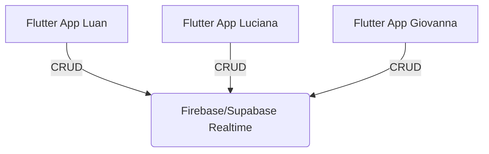

# System Design: App Casa Transparente

## Architecture
O aplicativo seguirá a stack:
- **Frontend App**: Flutter. Aplicativo mobile gerado para a Casa. 
- **BaaS (Backend as a Service)**: Supabase ou Firebase Firestore (para fins de simplicidade e tempo real).
- **Gerenciamento de Estado**: Riverpod para atualização reativa da UI.

### Components
1. **Auth Service**: Login baseado em Email/Password fixos por pessoa ou o AuthLink (visto que temos apenas 3 membros na casa). Os Users IDs são estáticos: `user_luan`, `user_luciana`, `user_giovanna`.
2. **Dashboard Overview Component**: Faz o fetching dos saldos do mês e dívidas cruzando dados.
3. **Transaction Forms**: Formulários para captar o que foi comprado ou a dívida originada. Com upload de recibos por conta de uso da câmera.

## Data Model
- **`profiles`**
  - id, name
- **`expenses`**
  - id, description, total_amount, category (FIXA, MERCADO), paid_by (referência user_id), created_at, receipt_url, month.
- **`expense_splits`**
  - id, expense_id, user_id, amount, status (PENDING, PAID).

## Interface / UX
- **Abas do App**: [Home] (Status e Dash de Cobrança), [Mercado] (Gasto orçado e Upload de NFC-e), e [Lançar Despesa].
- Notificações de Push a serem integradas (opcional no MVP) se a cota do mercado for atingida. 
- Sem tela de edição complexa. Uma dívida lançada mostra as cotas na cor verde ou vermelho se pago/não pago.
