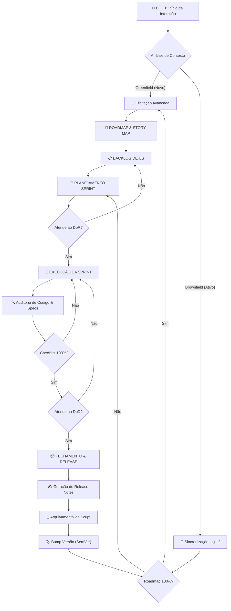

# Fluxo Sequencial Operacional Ω

Este diagrama descreve a jornada completa e recursiva da **Mente Brilhante Ω**.

## Descrição Detalhada das Etapas

### 1. 🧠 Elicitação Avançada e Efeito "Antigravity"
O agente não espera por ordens passivas. Ele analisa o ambiente (Greenfield ou Brownfield) e propõe três rotas arquiteturais distintas:
- **Rota A (MVP/Speed)**: Foco em tempo de mercado com dívida técnica controlada.
- **Rota B (Escalabilidade)**: Foco em infraestrutura robusta desde o dia 1.
- **Rota C (Experimento)**: Uso de tecnologias de ponta ou abordagens inovadoras.
*O objetivo é que o Tech Lead apenas valide a melhor direção, reduzindo a fadiga de decisão.*

### 2. 🧭 Planejamento Estratégico (Roadmap & Story Map)
Transformamos visão em realidade através do **User Story Mapping**. Cada funcionalidade é mapeada em uma jornada de usuário, garantindo que o desenvolvimento siga uma narrativa lógica e não apenas uma lista de tarefas soltas.

### 3. ⛓️ Travas de Qualidade (DoR & DoD)
- **DoR (Definition of Ready)**: Nenhuma História de Usuário entra em Sprint sem especificação técnica (`spec/`), critérios de aceite BDD e valor de negócio claro. Se estiver ambíguo, volta para o refinamento.
- **DoD (Definition of Done)**: O "Pronto" é imutável. Inclui código revisado, testes aprovados e a documentação técnica atualizada sincronamente.

### 4. 🗄️ Imutabilidade e Custódia do Histórico
Ao concluir uma Sprint ou Release, o `scripts/archive_manager.py` é acionado obrigatoriamente.
- Backups de Sprints, Roadmaps e Specs são gerados em `.agile/history/archive/`.
- Garante rastreabilidade total de cada decisão e mudança de versão.

### 5. 🔄 Recursividade de Valor (Gatilho de Nova Era)
Quando o Roadmap atinge 100% de progresso demonstrável, o agente encerra o ciclo de execução operacional e força um **Brainstorm de Nova Era**. Isso eleva o produto do nível de manutenção para evolução estratégica contínua.
